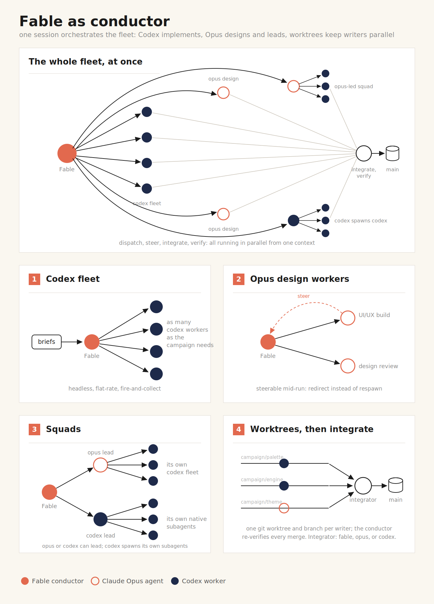
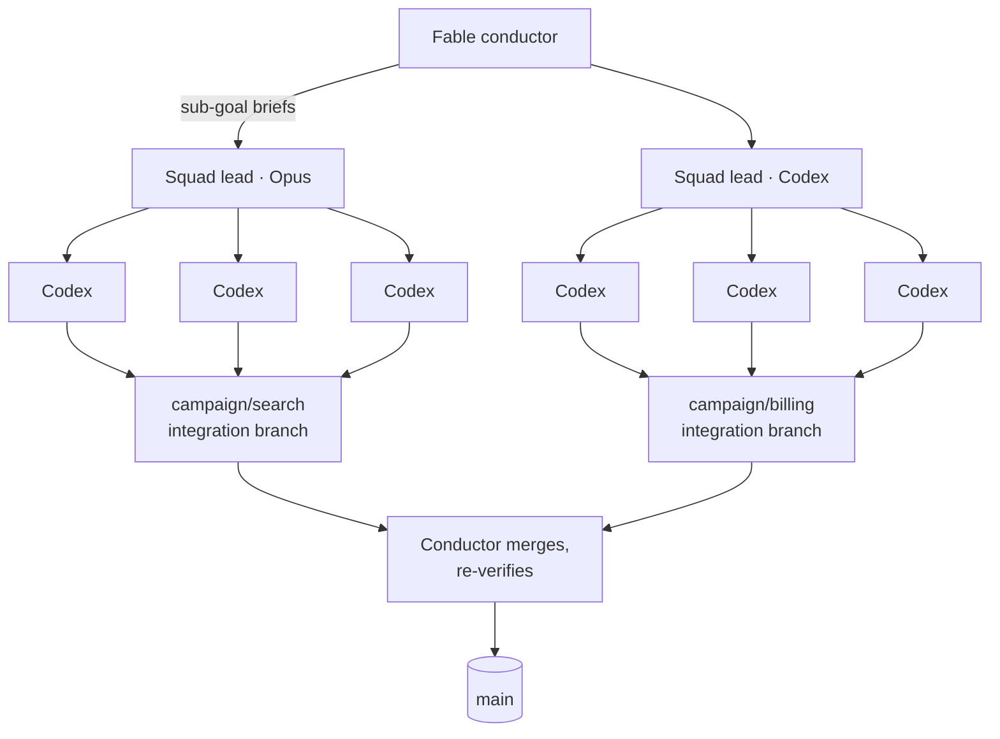

<p align="center">
  
</p>

# A Fable of Codexes

[](https://github.com/jvogan/a-fable-of-codexes/actions/workflows/validate.yml)
[](https://agentskills.io/specification)
[](https://github.com/jvogan/a-fable-of-codexes/releases)
[](LICENSE)

Claude Code skills that make Claude (Fable, or Opus when Fable is unavailable)
the conductor of an AI worker fleet. The conductor surveys and plans,
dispatches many parallel OpenAI Codex CLI workers for implementation and
Claude Opus agents for design judgment, then integrates, reviews, and verifies
what comes back.

One session directs the whole effort: workers spend their own context on
implementation while the conductor's stays free for judgment, git worktrees
let many writers land in parallel without collisions, and campaign state
lives in the repo so any later session resumes mid-campaign without setup.

## Skills

### [campaign-conductor](skills/campaign-conductor/SKILL.md)

Runs a project as an orchestrated campaign.

- **Bootstrap.** First use in a repo copies templates from
  `assets/campaign-hq/` into `docs/campaign-hq/`: `CAMPAIGN.md` for the plan
  and fleet table, `LEARNINGS.md` for distilled lessons, `preferences.md` for
  worker routing, and `schemas/worker-result.json` for reports. It also adds a
  pointer to the project's CLAUDE.md so later sessions resume from repo state.
- **Routing.** Fable/Opus stays on planning, judgment, verification, and memory.
  Codex CLI handles implementation, tests, research, and mechanical refactors
  when available. Claude worker agents use the same briefs and reports when
  Codex is unavailable or exhausted. Live worker, model, and effort requests win
  over defaults, are written to `preferences.md`, and persist across sessions.
- **Campaign sizing.** Small projects get a directly written plan. Large or
  unfamiliar ones get a parallel survey fan-out that drafts the plan for
  sign-off first.
- **Parallel fleets.** One writer per tree: git worktree and branch per
  worker, a fleet table tracking every dispatch with its session id,
  integration handled as its own dispatched task, and big campaigns
  structured as waves: dispatch, collect, integrate, verify. Finished Codex
  sessions resume with context intact for incremental corrections.
- **Squads.** For cohesive sub-goals, a Claude squad lead dispatches its own
  Codex workers, integrates, verifies, and returns one branch, with a hard
  depth cap, an exclusive branch namespace, and per-leaf evidence required
  in its report.
- **Review gates.** Fixed-schema worker reports, cross-model review (Claude
  reviews Codex diffs and Codex reviews Claude's), and same-brief bake-offs
  judged on artifacts for high-stakes tasks.
- **Worker capabilities.** Doctrine covers Codex web search for research
  scouts, image input for UI fixes from screenshots, native image generation
  for assets, and review mode.
- **Permissions.** The worker power envelope is set once at kickoff and
  recorded (Codex sandbox level, network access, Claude permission mode), so
  no wave stalls on a mid-run prompt.
- **Compounding memory.** Every dispatch outcome and user correction is
  logged, then compacted into standing rules so the files stay cheap to read
  at session start.
- **Progressive disclosure.** The main SKILL.md is a short conductor checklist.
  Detailed Codex dispatch, worktree/wave operations, squads, and review gates
  live in `references/` and load only when needed.

[`examples/campaign-hq/`](examples/campaign-hq/) shows the state files
mid-campaign, including a worked worker brief and the report schema.

### Orchestration patterns

<p align="center">
  
</p>

The panels are worked examples. Any capable worker can lead, integrate, or
review, and a campaign composes whatever shape the work needs.

Squads nest the fan-out: a squad lead (Opus or Codex) dispatches its own
parallel workers, integrates their branches, and hands the conductor one
verified branch. Tested end to end both ways: a spawned Opus lead ran Codex
workers in parallel worktrees, each landing its own commit, and a Codex lead
fanned out its native subagents inside one workspace.



Campaign state lives in the project, so any later session resumes it:

```
docs/campaign-hq/
├── CAMPAIGN.md      plan, phases, fleet table
├── LEARNINGS.md     standing rules + dispatch log
├── preferences.md   worker routing, permission envelope
├── briefs/          one file per dispatch
├── out/             collected worker reports
└── schemas/         worker-result.json
```

## Install

```bash
npx skills add jvogan/a-fable-of-codexes --skill campaign-conductor
```

or manually:

```bash
git clone --depth 1 https://github.com/jvogan/a-fable-of-codexes.git /tmp/afoc
cp -r /tmp/afoc/skills/campaign-conductor ~/.claude/skills/
```

## Use

Install the skill, then say in any project:

> start a campaign

Claude bootstraps `docs/campaign-hq/`, sizes the plan to the project, and
begins dispatching workers. From then on, every session in that repo picks up
the campaign automatically. Direct it in plain language:

- "add a phase for the billing migration"
- "use sonnet for tests from now on" (persists in `preferences.md`)
- "status" (reads the plan and fleet table)

## Requirements

- **Claude Code.** The skill uses the Agent and Workflow tools.
- **OpenAI Codex CLI** ([github.com/openai/codex](https://github.com/openai/codex)).
  Install with `npm install -g @openai/codex` (or `brew install codex`), then
  run `codex login`. ChatGPT-plan auth consumes plan usage and limits vary by
  plan; API-key auth is token-priced. Size worker waves to your available
  limits and spend tolerance. Set the default worker model and reasoning
  effort in `~/.codex/config.toml`, for example:

  ```toml
  model = "gpt-5.6-sol"
  model_reasoning_effort = "high"
  ```

  Reasoning runs a ladder (`low`, `medium`, `high`, `xhigh`, `max`, `ultra`),
  and the model ships in frontier, balanced, and fast variants. `high` on the
  frontier model is a sound default; reserve `max`/`ultra` for the hardest
  architecture and debugging. Override per task in plain language ("use ultra
  Codex for this wave", "send the mechanical refactor to the fast model"): the
  conductor writes the request to `preferences.md`, where it persists.

  Without Codex installed, the skill runs Claude-only fleets: Sonnet workers
  take the implementation role, Opus keeps design and squad-lead duty, and
  the briefs, worktrees, squads, and reports stay the same.
- **Codex plugin for Claude Code** (optional,
  [github.com/openai/codex-plugin-cc](https://github.com/openai/codex-plugin-cc)).
  Adds `/codex:review`, `/codex:adversarial-review`, and background-delegation
  slash commands for single interactive tasks. Install inside Claude Code:

  ```
  /plugin marketplace add openai/codex-plugin-cc
  /plugin install codex@openai-codex
  ```

## Validation

```bash
python3 scripts/validate.py
npx --yes skills add . --list
```

Checks every skill against the
[Agent Skills spec](https://agentskills.io/specification): frontmatter
fields, name format, and description length, plus this repo's 500-line body
limit and relative-link integrity. The `skills` command verifies that the
package is discoverable by the installer. CI runs both commands on every push
and pull request.

## License

MIT
